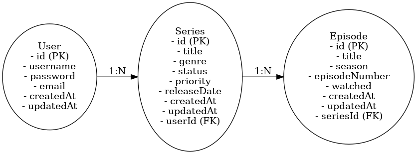

## Gerenciador de serie
## Autores- Nathalia Sampaio Sant’Anna Marques 2211416; Gian Lucas de Castro Berto 2256274; Fernanda Bochnie 1817795
## A API de Gerenciamento de Séries tem como objetivo auxiliar usuários no controle das séries e episódios que estão acompanhando. Ela permite o gerenciamento de usuários, séries e episódios, oferecendo funcionalidades como cadastro e autenticação de usuários, adição e remoção de séries, marcação de episódios assistidos, além de filtros e ordenação para facilitar a visualização do progresso.
# Gerenciador de Séries  

Este é um projeto de Gerenciador de Séries desenvolvido com NestJS e TypeORM, utilizando um banco de dados SQLite. O sistema permite cadastrar, visualizar, editar e remover séries, além de gerenciar episódios relacionados a cada série.

## Tecnologias Utilizadas  
- Node.js: Ambiente de execução do JavaScript.  
- NestJS: Framework para construção de APIs escaláveis.  
- TypeORM: ORM para gerenciamento de banco de dados relacional.  
- SQLite: Banco de dados utilizado no desenvolvimento.  

## Funcionalidades  
- Cadastro de Usuários: Criação de contas para acesso ao sistema.  
- Autenticação: Utilização de JWT para proteção de rotas.  
- Gerenciamento de Séries:  
  - Cadastro de séries com título, gênero, status, prioridade e data de lançamento.  
  - Edição e exclusão de séries cadastradas.  
  - Visualização de todas as séries do usuário autenticado.  
- Gerenciamento de Episódios:  
  - Adicionar e visualizar episódios relacionados a uma série específica.  

---

## Instalação  
Certifique-se de ter o Node.js instalado na sua máquina.  

1. Clone o repositório:  

git clone <URL_DO_REPOSITORIO>

2. Instale as dependências:
cd CONTROLE-DE-SERIES
npm install

##  Checklist de Funcionalidades do Gerenciador de Séries  

###  Cadastro de Séries  
- [x] Inserir título da série  
- [x] Selecionar gênero da série  
- [x] Definir status (assistindo, finalizada, pendente)  
- [x] Definir prioridade (alta, média, baixa)  
- [x] Informar data de lançamento  

###  Visualização de Séries  
- [x] Listar todas as séries cadastradas  
- [x] Exibir detalhes de cada série (título, gênero, status, prioridade e data de lançamento)  

###  Edição de Séries  
- [x] Atualizar informações de uma série existente  
- [x] Salvar alterações feitas na série  

###  Remoção de Séries  
- [x] Excluir uma série cadastrada  

###  Integração com Banco de Dados  
- [x] Conexão com banco de dados SQLite usando TypeORM  
- [x] Persistência de dados das séries no banco de dados  

###  API com NestJS  
- [x] Endpoints para operações CRUD (Create, Read, Update, Delete)  
- [x] Estrutura modular com controllers, services e modules  

###  Validação de Dados  
- [x] Garantir que todos os campos sejam preenchidos no cadastro  
- [x] Exibir mensagens de erro para campos obrigatórios não preenchidos  

###  Experiência do Usuário (UI/UX)  
- [x] Interface intuitiva para cadastro, edição e remoção  
- [x] Feedback visual para ações realizadas (ex: cadastro concluído)
